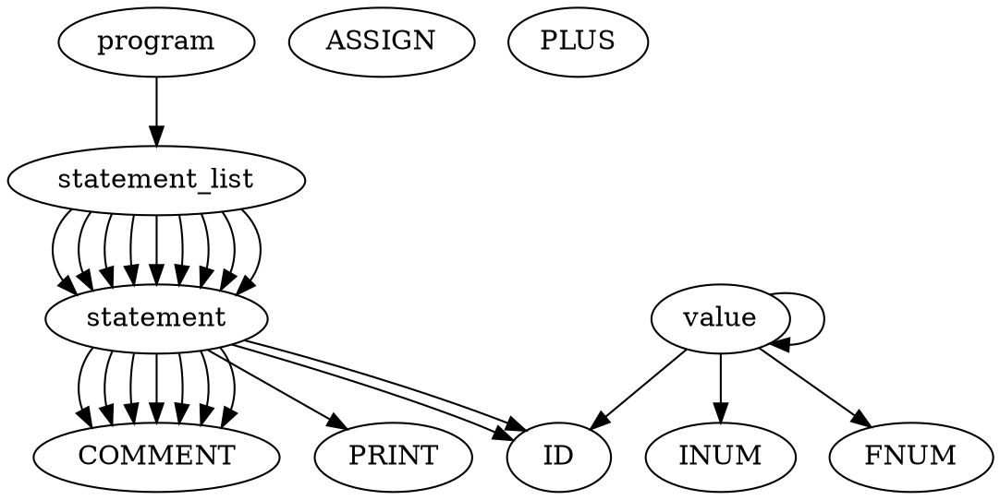

# Análisis Léxico y Sintáctico con Flex y YACC

Este proyecto realiza un análisis léxico y sintáctico de un archivo de entrada utilizando **Flex**, **YACC** y **C**, generando como resultado una representación en forma de árbol sintáctico (formato Graphviz).

---

## 🔧 Comandos a Ejecutar

1. **Generar el analizador léxico con Flex:**
   ```bash
   flex lex_analaizer.l
   ```

2. **Compilar el archivo generado por Flex:**
   ```bash
   gcc lex.yy.c -o lex_analaizer
   ```

3. **(Opcional) Generar archivo de ejemplo:**
   > Este paso ya no es necesario, pero se puede utilizar para generar un archivo de entrada de prueba.
   ```bash
   python3 code_generator.py > example.ac
   ```

4. **Ejecutar el analizador léxico sobre un archivo de entrada (.ac):**
   ```bash
   ./lex_analaizer example.ac
   ```

   Esto generará el archivo `tokens.out` con la lista de tokens.

5. **Compilar el parser con `make`:**
   ```bash
   make
   ```

6. **Ejecutar el análisis sintáctico:**
   ```bash
   ./syntax-calc < tokens.out
   ```

---

## 📄 Ejemplo de tokens.out generado

```text
COMMENT
COMMENT
COMMENT
COMMENT
id
assign
inum
COMMENT
id
assign
id
plus
fnum
COMMENT
print
id
```

---

## ✅ Output esperado en terminal

```text
statement -> COMMENT;
statement_list -> statement;
statement -> COMMENT;
statement_list -> statement;
statement -> COMMENT;
statement_list -> statement;
statement -> COMMENT;
statement_list -> statement;
value -> INUM;
statement -> ID ASSIGN value;
statement_list -> statement;
statement -> COMMENT;
statement_list -> statement;
value -> ID;
value -> FNUM;
value -> value PLUS value;
statement -> ID ASSIGN value;
statement_list -> statement;
statement -> COMMENT;
statement_list -> statement;
statement -> PRINT ID;
statement_list -> statement;
digraph G {
  program -> statement_list;
}
```

---

## 🌐 Output a usar en [Graphviz Online](https://dreampuf.github.io/GraphvizOnline/)



---

## 🖼️ Gráfico Esperado


